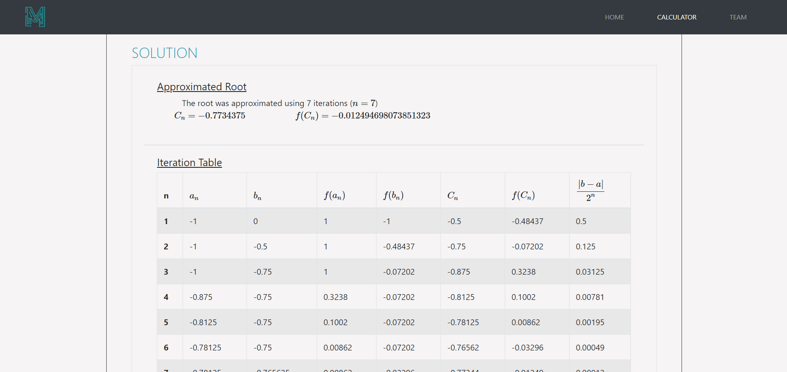
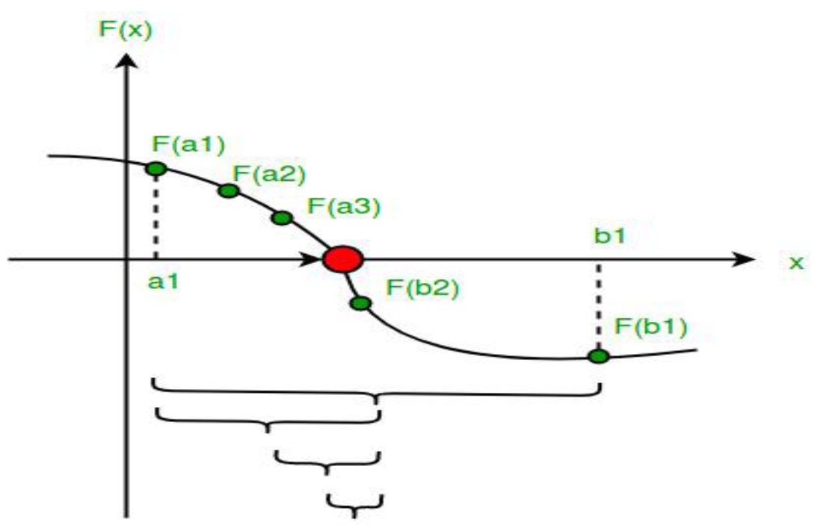
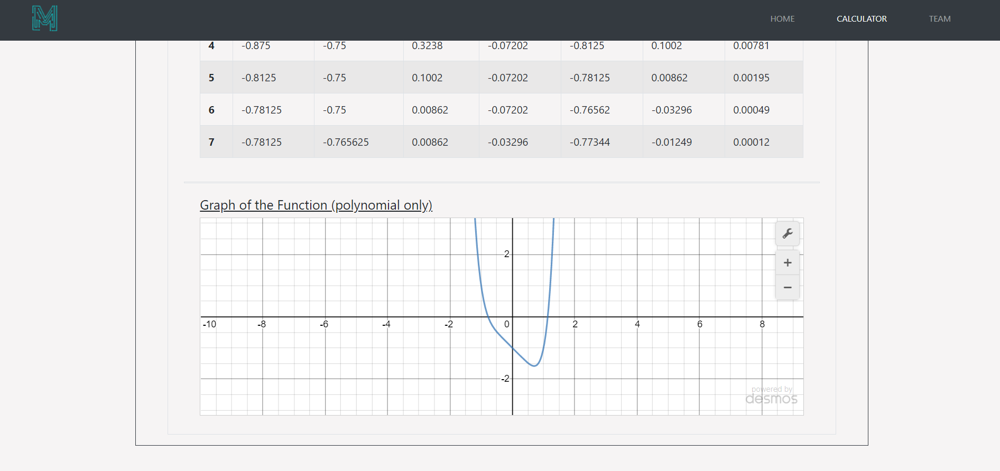

# Bisection Method Calculator

The Bisection method is one of the simplest numerical methods to find the zero or root of a non-linear function. The bisection method is also called interval halving method because it divides the interval into two equal parts. Half of the interval is thrown away. The procedure in bisection method is repeated until the desired interval size or iteration is obtained.
Objective.

## Objective
The program’s objective is to approximate the root in the f(x) in the given interval of the function.

> To begin, set a1 = a and b1 = b and let p1 the midpoint of [a, b]
> If f(p1) and f(a1) have the same signs, set a2 = p1 and b2 = b1
> Otherwise, If f(p1) and f(a1) have opposite signs, set a2 = a1 and b2 = p1

## Scope
The program’s graph in the solution area of the program does not support any logarithmic and trigonometric function. It does show the step by step iteration solution in every input but the value of the table is limited only 5 decimals (chopped). The program gives the answer in exact value. All of the equations are supported in the program.

